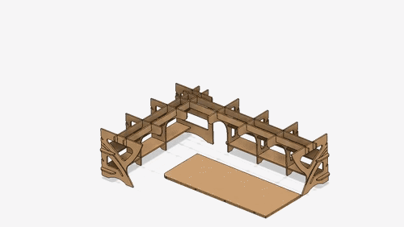
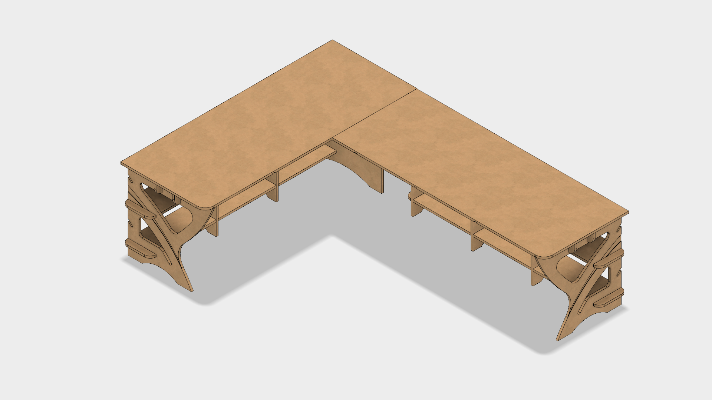
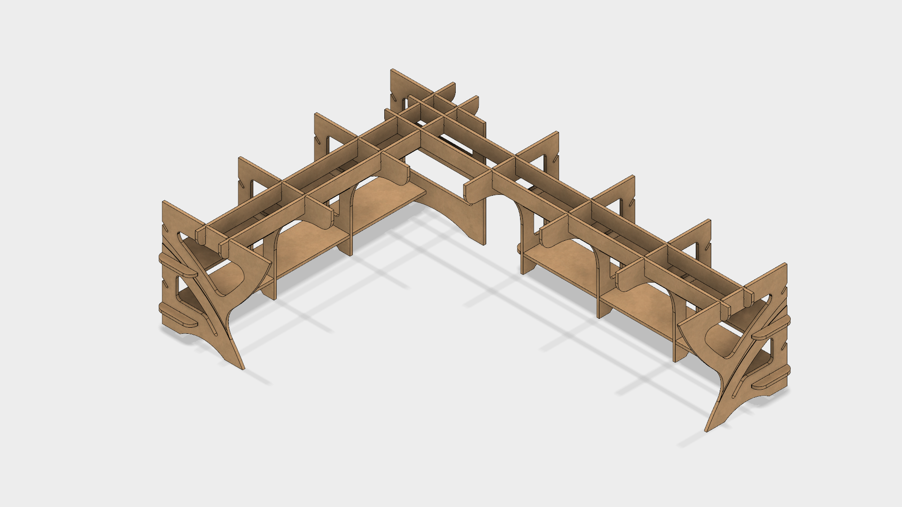
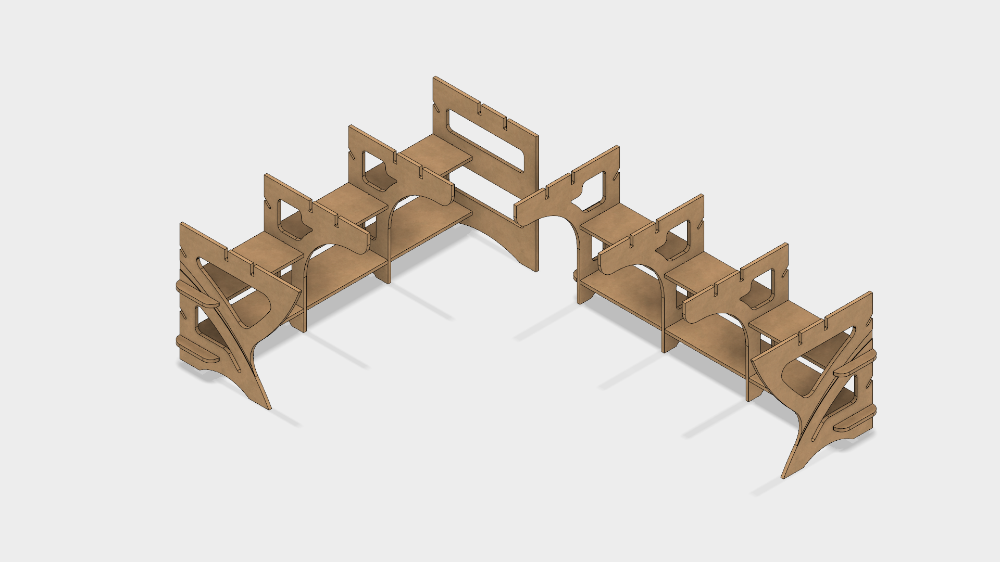
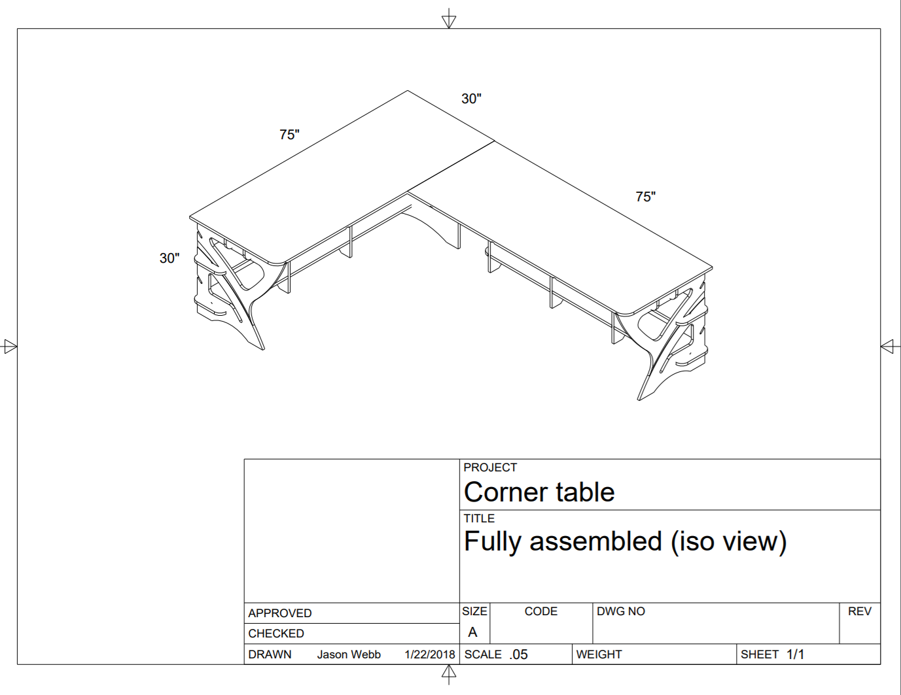
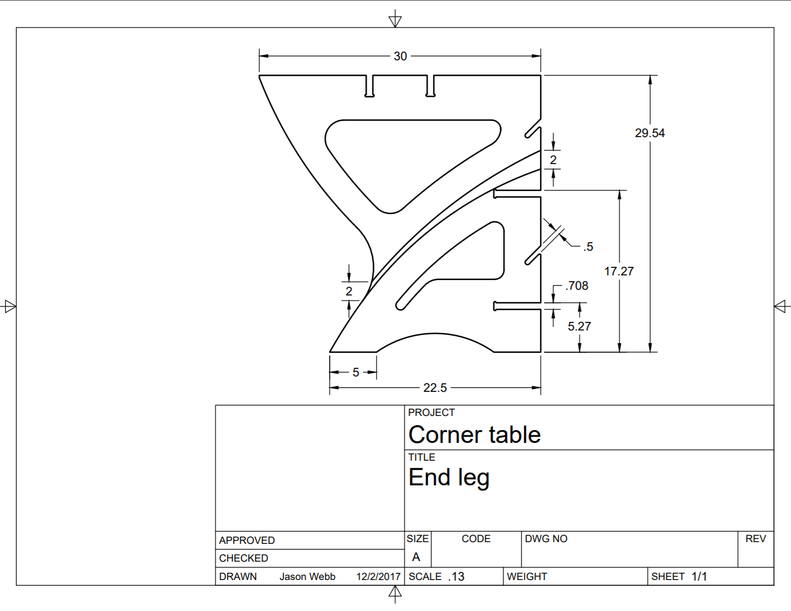

This repository contains the main Fusion 360 project file (`Corner table.f3d`) that I used to create a flat-pack corner table for my apartment.

The design has some parametric functionality that you can play with in Fusion 360 under `Modify > Change Parameters`. Most important of which is the `Thickness_Global` parameter that should be set to the real measured thickness of the stock you use.

All parts were routed out of 3/4" birch plywood using a low-end [4x4' CNC router](https://github.com/jasonwebb/tc-maker-4x4-router) at my local makerspace.

All CAM (toolpath) profiles are included in the project file and are optimized for my particular CNC machine. At a minimum you should verify or adjust the feeds, speeds, tool parameters, and stepdown to match the requirements of your machine.

# Bill of materials
| Part name     | Qty |
|---            |---  |
| End leg       | 2   |
| Inner end leg | 1   |
| Leg           | 5   |
| Inner leg     | 1   |
| Shelf         | 4   |
| Short spine   | 2   |
| Long spine    | 2   |
| Surface       | 2   |

Note that the surfaces have a rounded corner that is in a different spot between the left and right sides. Omit this operation to get square corners and thus interchangeable surfaces.

Also note the inset 'swoop' on the outer surface of the end legs, making the the two legs mirror images of each other. You can omit the swoop operation to get two identical, interchangeable legs.

# Renders

# Technical drawings

Drawings for all of the parts for this project are available in the [drawings/](drawings/) folder.